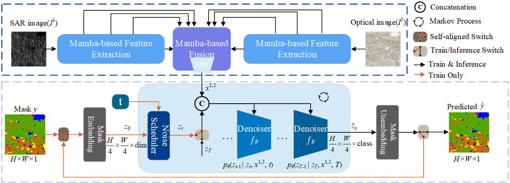
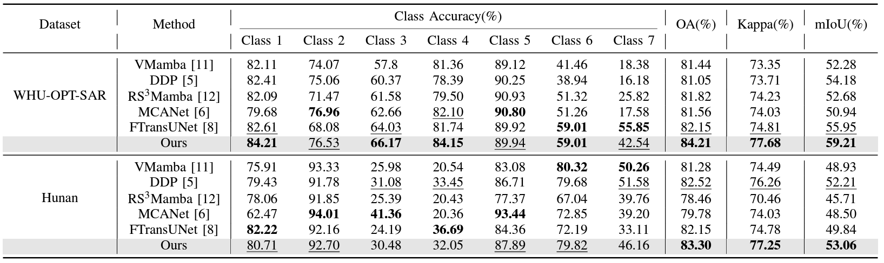

# A Mamba-Diffusion Framework for Multimodal Remote Sensing Image Semantic Segmentation
Wen-Liang Du, Yang Gu, Jiaqi Zhao, Hancheng Zhu, Rui Yao and Yong Zhou

[Paper's link](https://ieeexplore.ieee.org/document/10733944) 

## Overview

### Abstract
```
We propose a mamba-diffusion framework to preserve geometric consistency in segmentation masks. This framework preserves geometric consistency by introducing a generative diffusion-based semantic segmentation pipeline and developing a Mamba-based multimodal fusion model. The fusion model fuses the multimodal images in multiple scales and scanning mechanisms by a double cross-fusion (DCF) module. Then, the cross-modal information is further integrated by a dual-splitting structured state-space (DS-S4) model. Finally, the diffusion-based segmentation pipeline predicts semantic masks by progressively refining random Gaussian noise, guided by fused multimodal features. Our experimental results, verified on WHU-OPT-SAR and Hunan datasets, demonstrate that the proposed framework surpasses state-of-the-art (SOTA) methods by a considerable margin.
```
### Framework



## Getting Started

Experientially, we recommended to configure mamba environment before installing mmseg framework
```
# recommended to create a new environment with torch1.13.0 + cuda11.7
pip install torch==1.13.0+cu117 torchvision==0.14.0+cu117 torchaudio==0.13.0 
--extra-index-url https://download.pytorch.org/whl/cu117
```

### Step1: Vmamba
```
# Mamba-ssm
pip install causal-conv1d==1.1.1
pip install mamba-ssm==1.1.1

# Vmamba
git clone https://github.com/MzeroMiko/VMamba.git
cd VMamba
pip install -r requirements.txt
cd kernels/selective_scan && pip install .
```

### Step2: MMSegmentation
The code is based on the MMSegmentation v0.30.0. 

See [MMSegmentation](https://github.com/open-mmlab/mmsegmentation) for more details on how to install the MMSegmentation framework

```
pip install mmcv-full==1.7.2 -f https://download.openmmlab.com/mmcv/dist/cu117/torch1.13.0/index.html

cd Mamba-Diffusion
pip install -v -e .
```

## Results


### Checkpoints
```
https://pan.baidu.com/s/14IloqNUx746n8GjSZj0odA?pwd=pu62 
password：pu62 
```


## Training

Multi-gpu training
```
bash tools/dist_train.sh ${CONFIG_FILE} ${GPU_NUM}
```
For example, To train Our model on whu-opt-sar with 4 gpus run:
```
bash tools/dist_train.sh configs/whu/ddp_fuse-mamba_4x4_256x256_160k_whu-fianl.py 4
```


## Evaluation

Single-gpu testing
```
python tools/test.py ${CONFIG_FILE} ${CHECKPOINT_FILE} --eval mIoU
```

Multi-gpu testing
```
bash tools/dist_test.sh ${CONFIG_FILE} ${CHECKPOINT_FILE} ${GPU_NUM} --eval mIoU
```
